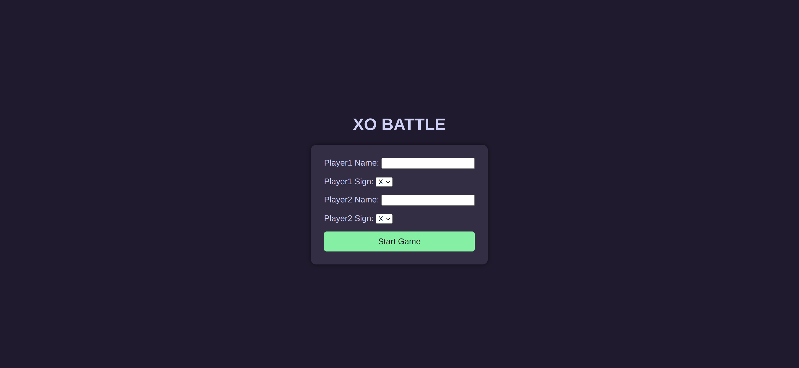
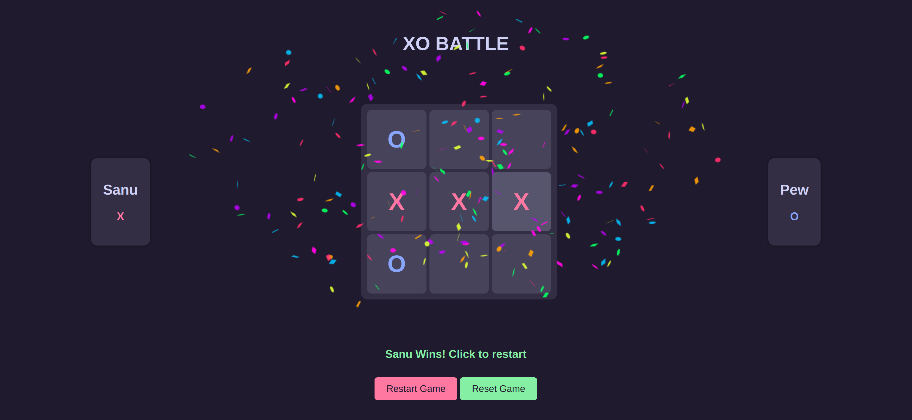

# XO Battle

XO Battle is a simple web-based Tic-Tac-Toe game where two players can compete against each other.

## Live Website

https://idevravn.github.io/XO-Battle/

## Table of Contents

- [Features](#features)
- [How to Play](#how-to-play)
- [Getting Started](#getting-started)
- [Built With](#built-with)
- [Acknowledgements](#acknowledgements)
- [Contributing](#contributing)
- [License](#license)

## Features

- Two-player Tic-Tac-Toe game
- Players can enter their names and choose their signs
- Smooth transition from the player form to the game board
- Confetti effect when a player wins
- Reset and restart game functionality

## How to Play

1. Enter the names of Player 1 and Player 2.
2. Choose the signs (X or O) for each player.
3. Click the "Start Game" button to begin the game.
4. Players take turns clicking on the cells of the game board to place their signs.
5. The game announces the winner and displays a confetti effect when a player wins.
6. Use the "Reset Game" button to restart the game with the same players.
7. Use the "Restart Game" button to go back to the player form and start a new game with different players.

## Getting Started

To view the XO Battle Website:

1. Clone the repository: `git clone https://github.com/idevRavn/XO-Battle.git`
2. Open `index.html` in your preferred web browser.

## Built With

- HTML
- CSS
- JavaScript

## Acknowledgements

- [canvas-confetti](https://www.npmjs.com/package/canvas-confetti) for the confetti effect

## Contributing

Contributions are welcome! If you have ideas for improvement or want to add features, please fork the repository and submit a pull request.

## License

This project is licensed under the [MIT License](LICENSE), allowing for collaboration and sharing.

---
Enjoy playing **XO Battle**! 🏆
